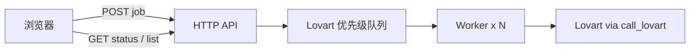

# Lovart 生图统一排队设计规格

**日期：** 2026-05-27  
**状态：** 已实现  
**范围：** 测试环境多人共用单 PM2 实例时，所有 Lovart 调用经内存优先级队列串行/限并发执行；主生图异步化并展示排队状态；低优任务（智能抠图 Lovart 兜底、规范延展 AI 阔图）让路主生图。

---

## 背景与问题

- 部署：`./deploy.sh remote` → 单进程 `ThreadingHTTPServer` + PM2 `instances: 1`，团队共用同一套 Lovart Key。
- 现状：`call_lovart()` 使用进程内 `LOVART_GENERATION_LOCK` 串行调用；`generate_variants` 对 Lovart 已按张串行；`.env` 中 `LOVART_MAX_CONCURRENCY=1` **未接入代码**。
- 主生图接口 `/generate-variants`、`/generate-with-prompt` 为**同步 HTTP**，多用户同时点击时：
  - 线程阻塞在锁上，连接长时间挂起，易超时；
  - 用户看不到「前面还有几人」；
  - 易重复点击，加剧排队与 Lovart「并发任务已满」错误。

智能抠图已有异步模式（`POST /api/smart-cutout` + 轮询 status），主生图尚无等价机制。

---

## 目标

1. **避免 Lovart 并发失败**：全站同时进行的 Lovart API 调用数 ≤ `LOVART_MAX_CONCURRENCY`（默认 1）。
2. **可见等待**：提交后立即返回 `job_id`，可轮询 `position`、`progress`、`eta_seconds`。
3. **可离开再回来**：通过 `client_id` + 任务列表 API 恢复查看进行中/近期任务。
4. **优先级**：主生图 / AI 修图为 `high`；智能抠图 Lovart 兜底、规范延展 AI 阔图为 `low`（同队列，high 先出队）。
5. **限流**：全局队列上限；每 `client_id` 同时仅 1 个生图类（high）任务处于 `queued` 或 `running`。

---

## 非目标（首版）

- Redis / 数据库持久化队列（重启丢任务，用户重试）。
- 登录用户体系（用浏览器 `client_id` 区分「每人」）。
- 管理后台查看全站队列。
- 低优任务防饿死（长时间提升优先级）。
- 非 Lovart 后端（即梦 / ComfyUI / SD）排队。

---

## 方案选择

**选用：方案 1 — 统一 Lovart 任务队列（`lovart_queue.py`）**

| 方案 | 说明 | 不选原因 |
|------|------|----------|
| 1 统一队列 | 所有 Lovart 经 `queue.submit(priority, fn)` | **选用** |
| 2 仅主生图队列 | 其它仍抢 `LOVART_GENERATION_LOCK` | 两套机制，低优仍干扰 |
| 3 Redis/RQ | 外部队列 | 与「内存队列」决策冲突，运维成本高 |

---

## 架构



### 模块职责

| 模块 | 职责 |
|------|------|
| `backend/lovart_queue.py` | 内存队列、优先级、worker 池、job 状态、`position`/`eta` 计算 |
| `backend/app.py` | 路由、multipart 解析、`queue.submit`、非 Lovart 路径不变 |
| `call_lovart()` | 逻辑不变，**仅**由 queue worker 调用 |
| `backend/templates/index.html` | 提交任务、轮询、任务列表 UI |

### 并发与锁

- `LOVART_MAX_CONCURRENCY`：worker 线程数（默认 1）。
- **移除** `LOVART_GENERATION_LOCK`（由队列 worker 保证 Lovart 并发上限）。
- 队列内部：`queue.PriorityQueue` 或等价结构；元组 `(priority_rank, enqueue_seq, job)`，`high=0`、`low=1`，同优先级 FIFO 用 `enqueue_seq`。

---

## 队列语义

| 配置项 | 环境变量 | 默认 | 说明 |
|--------|----------|------|------|
| Worker 数 | `LOVART_MAX_CONCURRENCY` | 1 | 同时执行 Lovart 的 job 数 |
| 全局上限 | `LOVART_QUEUE_MAX` | 20 | `queued` + `running` 总数 |
| 已完成保留 | `LOVART_JOB_TTL` | 3600 | 秒，内存中供查询 |
| 单 job 上限 | `LOVART_JOB_MAX_SECONDS` | 1800 | 整任务超时 |
| ETA 粗估 | `LOVART_ETA_AVG_SECONDS` | 90 | 单张平均秒数 × 前方任务量 |

### 优先级

- **`high`**：`kind` 为 `variants`、`with_prompt`、`edit`（主生图、魔法图、AI 修图）。
- **`low`**：smart-cutout 的 Lovart 兜底步骤；layout-extend 的 `use_ai` 阔图。

### 每人 1 任务（仅 high）

- 同一 `client_id` 若已有 `queued` 或 `running` 的 **high** 任务，再次 `POST` 返回 **409**，body 含现有 `job_id`。
- **low** 任务不占「每人 1 生图」名额（避免抠图阻塞再次生图）；但若全局队列满仍 503。

### 全局满

- `queued + running >= LOVART_QUEUE_MAX` → **503**，文案：「队列已满（最多 N 个），请稍后再试」。

### 服务重启

- PM2 reload / deploy：内存队列清空；原 `running` → `failed`，`error`: 「服务已重启，请重新生成」。
- 已完成结果以现有 `history.json` 落盘为准；内存任务列表为辅助。

---

## HTTP API

### 客户端标识

- 前端首次访问生成 `client_id` 存入 `localStorage`（键名如 `aizhushou_client_id`）。
- 请求携带：`X-Client-Id` 头或表单字段 `client_id`。

### 新接口

#### `POST /api/generation/jobs`

创建生图类任务（multipart，字段与现 `/generate-variants`、`/generate-with-prompt` 对齐）。

| 字段 | 说明 |
|------|------|
| `kind` | `variants` \| `with_prompt` \| `edit` |
| `client_id` | 必填 |
| 其它 | `project`, `count`, `ratio`, `prompt`, `summary`, `file`, `ref_image_*`, `image_backend` 等（沿用现有） |

**201 响应示例：**

```json
{
  "ok": true,
  "job_id": "a1b2c3d4e5f6",
  "status": "queued",
  "position": 2,
  "status_url": "/api/generation/jobs/a1b2c3d4e5f6"
}
```

**409**：该 `client_id` 已有 high 任务 → `{ "error": "...", "job_id": "..." }`  
**503**：队列已满

#### `GET /api/generation/jobs/{job_id}`

```json
{
  "job_id": "a1b2c3d4e5f6",
  "client_id": "...",
  "kind": "variants",
  "status": "running",
  "priority": "high",
  "position": 0,
  "progress": { "current": 2, "total": 4 },
  "eta_seconds": 180,
  "variants": null,
  "error": null,
  "queue_depth": 5
}
```

`status` 枚举：`queued` | `running` | `done` | `failed` | `cancelled`（首版可不实现 cancel）

`done` 时 `variants` 与现同步接口一致：`[{ "filename": "...", "error": null }, ...]`

#### `GET /api/generation/jobs?client_id=...`

返回该客户端：所有 `queued`/`running` + 最近 `done`/`failed`（在 `LOVART_JOB_TTL` 内），按创建时间倒序。

### 现有接口调整

| 路径 | 调整 |
|------|------|
| `/generate-variants`, `/generate-with-prompt` | 首版可 **废弃并改前端直调新 API**；若需兼容可内部 `submit` + 阻塞等待至 `LOVART_JOB_MAX_SECONDS`（不推荐长期保留） |
| `/api/smart-cutout` | 仍立即返回 `job_id`；Lovart 步骤改为 `queue.submit(low, ...)` |
| `/api/layout-extend` | `use_ai=1` 时阔图走 `low` 队列 |

### 非 Lovart 后端

`IMAGE_BACKEND` 为 `dreamina` / `comfyui` / `stable_diffusion` 时：**不入队**，保持现有同步或 `ThreadPoolExecutor` 逻辑。

---

## 任务执行逻辑

### Worker 执行 high 生图 job

1. 校验 `lovart_project_required_error`（失败则 `failed`）。
2. `ensure_lovart_project`（与现 `generate_variants` 一致）。
3. 循环 `count` 次调用 `call_image_generator`（Lovart 串行在单 worker 内自然成立；多 worker>1 时由队列保证总并发）。
4. 每完成一张更新 `progress.current`；下载到 `outputs/`。
5. 全部完成后 `add_history(...)`，`status=done`。

### Lovart 失败处理

- 沿用 `call_lovart`：多 Key、`LOVART_TASK_RETRY`、`_normalize_lovart_error`。
- 单张失败：记入对应 `variants[i].error`，继续下一张。
- 不可恢复错误：整 job `failed`。

### 超时

| 层级 | 规则 |
|------|------|
| 单张 | `LOVART_POLL_TIMEOUT`（默认 300s） |
| 整 job | `LOVART_JOB_MAX_SECONDS`（默认 1800s）→ `failed`，已生成张保留 |

---

## 前端（`index.html`）

1. **`generateWithKeyword` / `generateVariants`**：改为 `POST /api/generation/jobs` + 轮询（间隔 2–3s）。
2. **状态条**：`queued` 显示「排队中，前面还有 N 人」；`running` 显示「生成中 2/4」；`failed` 显示错误。
3. **按钮**：有进行中 high 任务时禁用；收到 409 时提示并跳转轮询已有 `job_id`。
4. **历史抽屉**：顶部增加「进行中 / 排队」列表，进入页面时 `GET /api/generation/jobs?client_id=` 恢复。
5. **轮询超时 UI**：超过 `LOVART_JOB_MAX_SECONDS` 仍 `running` 时提示刷新任务列表。

---

## 配置（`.env.example` 增补）

```env
LOVART_MAX_CONCURRENCY=1
LOVART_QUEUE_MAX=20
LOVART_JOB_TTL=3600
LOVART_JOB_MAX_SECONDS=1800
LOVART_ETA_AVG_SECONDS=90
```

---

## 日志

```
[Queue] enqueued job=a1b2c3 priority=high position=2 client=abc...
[Queue] started job=a1b2c3 worker=0
[Queue] progress job=a1b2c3 2/4
[Queue] done job=a1b2c3 duration=312s
[Queue] failed job=a1b2c3 error=...
```

---

## 测试要点（实现阶段）

1. 单用户提交 → 立即 `queued`/`running`，轮询至 `done`，变体可下载。
2. 两浏览器不同 `client_id` 同时提交 → 第二个 `position>=1`，Lovart 无并发报错。
3. 同一 `client_id` 连续两次 POST high → 第二次 409。
4. 队列塞满 → 503。
5. high 与 low 同时排队 → high 先执行。
6. `IMAGE_BACKEND=comfyui` → 不入队，行为与改前一致。
7. PM2 restart → 进行中任务 `failed` 文案正确。

---

## 需求追溯

| 决策 | 选择 |
|------|------|
| 主要痛点 | C：Lovart 失败 + 无等待反馈 |
| 排队范围 | C：全 Lovart，主生图 high / 其它 low |
| 交互 | C：异步 + 可离开再查 |
| 持久化 | A：仅内存 |
| 限流 | C：全局上限 + 每人 1 个 high 进行中 |

---

## 实现后文档

- 更新 `README.md`、`AGENTS.md` HTTP API 表与 `.env.example` 注释。
- `ENVIRONMENT.md` 测试环境多人使用说明（排队、重启）。
