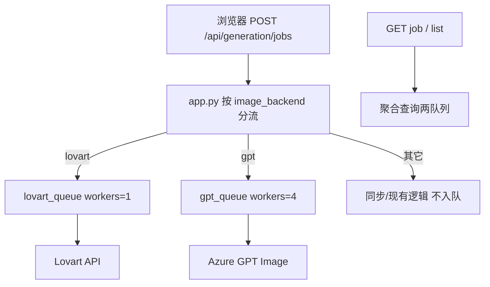

# GPT 生图独立排队与并发优化设计

**日期：** 2026-07-29  
**状态：** 已实现  
**范围：** 将 GPT 主生图从 Lovart 串行队列中拆出；提高 GPT 全站并发；单 job 多张变体可并行；保留现有异步 job / 轮询 API 与前端体验。

**关联：** `2026-05-27-lovart-generation-queue-design.md`（Lovart 队列仍有效；本规格只改 GPT 路径与查询聚合）

---

## 背景与问题

- 主生图统一走 `POST /api/generation/jobs` → `lovart_queue`，worker 数由 `LOVART_MAX_CONCURRENCY`（默认 **1**）控制。
- 团队当前大量使用 GPT（Azure 公司网关），仍与 Lovart **共用同一条串行队列**：
  1. 多人同时 GPT 生图互相堵；
  2. 单任务 `count>1` 在 job 内 for 循环串行；
  3. GPT 任务占用 Lovart worker，反过来 Lovart 也会堵住 GPT。
- Lovart 需要低并发（易「并发任务已满」）；GPT 通常可承受更高并发。两者不应共用同一限流。

Azure / 公司网关确切配额不确定 → 默认中等并发，全部经 `.env` 可调。

---

## 目标

1. **GPT 与 Lovart 分队列**，互不阻塞。
2. **全站 GPT API 并发**默认 4，可配置。
3. **单 GPT job 内多张变体并行**，且不突破全站上限。
4. **前端尽量零改**：仍用 `/api/generation/jobs` + 轮询；查询聚合两队列。
5. **每人同时仅 1 个 high 生图任务**跨两队列生效。

## 非目标（首版）

- Redis / 持久化队列。
- 按项目组（XDT/HLL）拆队列或拆 Key 池。
- 即梦 / ComfyUI / SD 入队。
- 动态探测 Azure 配额、按模型（image-2 vs mini）分池。
- GPT 扩边 / AI 提取等同步 HTTP 强制入异步 job（仅用信号量限流即可）。
- 低优任务防饿死、管理后台。

---

## 方案选择

选用：**方案 B — 双队列 + 任务内并行**

| 方案 | 说明 | 结论 |
|------|------|------|
| A 只调大 `LOVART_MAX_CONCURRENCY` | 零改动 | 否：拖垮 Lovart，且不解决互堵 |
| **B 双队列 + job 内并行** | GPT/Lovart 分池，GPT 多张并行 | **选用** |
| C GPT 不排队只靠 semaphore | 实现简单 | 否：丢失排队位置与公平调度 |

---

## 架构

### 模块职责

| 模块 | 职责 |
|------|------|
| `backend/lovart_queue.py` | 泛化为可复用的 `GenerationQueue`（或保留类名、双实例）；优先级、worker、job 注册表、position/eta |
| `backend/app.py` | 创建 `lovart_queue` / `gpt_queue`；提交分流；GET 聚合；GPT job 内并行；跨队列 duplicate 检查 |
| `backend/gpt_image_client.py` | 不变（已有 429 重试）；不在此层做全局排队 |
| `backend/templates/index.html` | 首版尽量不动；若文案需区分「GPT 排队」可后续小改 |

### 队列实例

- `lovart_queue`：`max_workers = LOVART_MAX_CONCURRENCY`（默认 1）
- `gpt_queue`：`max_workers = GPT_MAX_CONCURRENCY`（默认 4）
- 实现上优先 **复用同一队列类**，避免复制逻辑。

---

## 并发预算

| 层级 | 控制 | 默认 |
|------|------|------|
| Lovart worker | `LOVART_MAX_CONCURRENCY` | `1` |
| GPT worker / 全站 GPT API 槽位 | `GPT_MAX_CONCURRENCY` | `4` |
| 单 GPT job 内并行 | `min(count, GPT_VARIANT_PARALLEL)`，且受全站槽位约束 | `GPT_VARIANT_PARALLEL=4` |

**唯一实现约定：**

1. `gpt_queue.max_workers = GPT_MAX_CONCURRENCY`（同时 `running` 的 GPT job 上限）。
2. 另建进程内全局 `threading.Semaphore(GPT_MAX_CONCURRENCY)`：每一次 GPT Image API 调用（含 job 内每张变体；同步扩边/提取若接入则同样 acquire）必须先拿到槽位再请求，结束后 release。这样「多 job × 多变体」合计不超过全站上限。
3. 单 job 内用线程池并行，池大小 = `min(count, GPT_VARIANT_PARALLEL)`；每张任务内再 acquire/release 上述 semaphore。
4. Lovart job 内仍 **串行** `for idx in range(count)`，不碰 GPT semaphore。

### 失败与进度

- 单张失败：写入对应 `variants[i].error`，继续其余张（与现状一致）。
- 429 / 5xx：沿用 `gpt_image_client` 重试。
- `progress.current`：按 **完成张数** 递增（可不按提交顺序）。
- 整 job 超时：复用 `LOVART_JOB_MAX_SECONDS` 或独立 `GPT_JOB_MAX_SECONDS`（首版可复用同一值）。

---

## 配置

| 变量 | 默认 | 说明 |
|------|------|------|
| `LOVART_MAX_CONCURRENCY` | `1` | 不变 |
| `LOVART_QUEUE_MAX` 等 | 现有 | 不变 |
| `GPT_MAX_CONCURRENCY` | `4` | GPT worker = 全站 GPT API 并发上限 |
| `GPT_QUEUE_MAX` | `20` | GPT 排队上限 |
| `GPT_JOB_TTL` | 复用 `LOVART_JOB_TTL`（3600） | 可不新增独立变量 |
| `GPT_JOB_MAX_SECONDS` | 复用 `LOVART_JOB_MAX_SECONDS`（1800） | 可不新增 |
| `GPT_ETA_AVG_SECONDS` | `45` | GPT 排队 ETA 粗估（秒/job） |
| `GPT_VARIANT_PARALLEL` | `4` | 单 job 内最多并行张数 |

文档同步：`.env.example`、`ENVIRONMENT.md`、`README.md` 配置表。

---

## HTTP API 行为

接口路径不变。

### 提交 `POST /api/generation/jobs`

1. 解析 `image_backend`。
2. `gpt` → `gpt_queue.submit_generation(...)`；`lovart` → `lovart_queue.submit_generation(...)`。
3. **跨队列**检查：同一 `client_id` 在任一队列已有 `queued`/`running` 的 high 任务 → **409**（body 含现有 `job_id`）。
4. 对应队列满 → **503**（文案带该队列上限）。

### 查询

- `GET /api/generation/jobs/{id}`：依次查两队列，找到即返回；都无则 404。
- `GET /api/generation/jobs?client_id=`：合并两队列结果，按 `created_at` 降序（或现有排序习惯）。
- GPT 任务的 `position` / `eta_seconds` **只相对 GPT 队列**计算，不与 Lovart 混算。

### 其它路径

| 路径 | 行为 |
|------|------|
| Lovart `run_sync`（修图等） | 仍只进 `lovart_queue` |
| GPT 扩边 / AI 提取（同步 HTTP） | 首版不强制入 gpt_queue；可选 acquire 同一 GPT semaphore 后直接调用 |
| dreamina / comfy / sd | 不入队 |
| PM2 reload | 两队列内存清空；与现网一致需用户重试 |

---

## 任务执行（GPT）

1. Worker 取出 GPT generation job。
2. 校验项目 / Key（沿用现有 `lovart_project_required_error` / GPT 可用性检查）。
3. 并行生成 `count` 张：
   - 线程池大小 ≤ `GPT_VARIANT_PARALLEL`；
   - 每张调用 `call_image_generator(..., image_backend="gpt", ...)` 前 acquire 槽位；
   - 下载、Logo 叠加、尺寸处理逻辑与现 `execute_generation_job` 的 GPT 分支一致（GPT 保留原生尺寸、不做二次裁切）。
4. 全部结束后写 history、`status=done`（或全部失败时的现有语义）。

Lovart 路径：逻辑保持串行，仅继续使用 `lovart_queue`。

---

## 测试要点

- GPT 与 Lovart 任务可同时 `running`，互不阻塞。
- 同一 `client_id` 先提交 Lovart 再提交 GPT（或反过来）→ 第二次 **409**。
- GPT `count=4` 且 `GPT_MAX_CONCURRENCY≥4` 时，总耗时明显短于串行；`progress` 最终到 4。
- `GPT_MAX_CONCURRENCY=1` 时行为接近现状（全站串行 GPT）。
- 队列满、超时、单张失败不拖死整 job（与现语义一致）。
- 单元测试覆盖：双队列路由、跨队列 duplicate、GPT 并行进度。

---

## 成功标准

1. 多人同时选 GPT 生图时，最多 `GPT_MAX_CONCURRENCY` 路真正打 API，其余可见排队位置。
2. Lovart 保持默认并发 1，不因 GPT 调大而一起放大。
3. 单用户一次生成多张 GPT 图，在槽位允许时并行完成。
4. 现有前端无需改提交/轮询流程即可受益。
5. 运维可通过 `.env` 将 `GPT_MAX_CONCURRENCY` 从 1 调到更高值而不改代码。

---

## 实现顺序（供计划拆分）

1. 队列类可双实例化 + `gpt_queue` 配置加载。
2. 提交分流 + 跨队列 409 + GET 聚合。
3. `execute_generation_job` GPT 分支并行 + semaphore。
4. 环境变量与文档。
5. 测试与手动验证。
