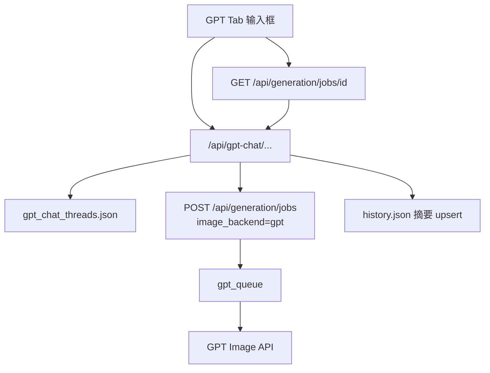

# GPT 聊天式生图 / 改图窗口设计

**日期：** 2026-07-30  
**状态：** 已确认  
**范围：** 在现有「生图」「修图」旁新增第三个主导航「GPT」，提供 ChatGPT 风格的多轮对话生图/改图；复用现有 GPT 生图队列与项目门禁。

**关联：**  
- `2026-05-28-gpt-image-backend-design.md`（GPT Image 后端）  
- `2026-07-29-gpt-generation-queue-design.md`（GPT 独立队列）  
- `2026-05-28-history-record-completeness-design.md`（历史记录）

---

## 背景与问题

当前「生图」入口是结构化表单：项目参考图、本地参考图、Logo 位置、尺寸类型、生成数量、模型、画质、主副标题等。对快速「打一句话出图 / 多轮改图」过重。

系统已具备 GPT Image 后端与独立排队，但缺少类似 GPT 官网的单输入框多轮体验。

## 目标

1. 新增主导航 **「GPT」**，打开即为聊天界面：单一输入框即可完成文生图与改图。
2. **真多轮对话**：结果出现在消息流中，可对上一张继续改。
3. **固定 GPT Image**，不走 Lovart。
4. **服务端持久化**对话；「生图/修图记录」可回看整段对话并续聊。
5. 默认 **1024×1024 + medium**；输入框旁可选比例 / 画质小图标，不点则用默认。
6. **项目门禁**：与其它页相同；用当前解锁项目的 GPT Key；对话绑定该项目。
7. 现有「生图」「修图」表单 **保持不变**。

## 非目标（首版）

- 不接 Lovart，无后端切换控件。
- 不选项目参考图库、不传 Logo / Logo 位置。
- 不做蒙版局部涂抹。
- 不从文案自动推断尺寸。
- 不做独立于项目门禁的全局 GPT 入口。
- 不新建第二套生图排队（必须复用现有 GPT `GenerationQueue`）。

---

## 方案选择

选用：**方案 1 — 轻量会话层 + 复用现有生图队列**

| 方案 | 说明 | 结论 |
|------|------|------|
| **1 会话层 + 复用 jobs** | 线程/消息落盘；出图走 `/api/generation/jobs` | **选用** |
| 2 独立 Chat API 全包生图 | 新队列与历史体系 | 否：重复建设 |
| 3 纯前端多轮 | 无服务端线程 | 否：不满足持久化与记录回看 |

---

## 架构与入口

### 入口

- 主导航在「生图」「修图」旁新增「GPT」Tab（`data-tab="gpt"`）。
- 页面结构：上方消息流，底部单一输入框（文字 + 可选附图）；旁有可选比例 / 画质控件。
- 空态：居中简短提示 + 底部输入框。

### 后端边界

| 模块 | 职责 |
|------|------|
| `backend/gpt_chat.py`（新建） | 线程 / 消息读写；续聊时解析「上一张成功出图」；与 history 摘要同步 |
| `backend/app.py` | 注册 GPT 聊天 HTTP 路由；鉴权；提交时调用现有 GPT 队列 |
| 现有 `/api/generation/jobs` | 实际出图；GPT Tab 只走 `image_backend=gpt` |
| `backend/templates/index.html` | GPT Tab UI、轮询、历史摘要点击续聊 |

落盘文件建议：`gpt_chat_threads.json`（与 `history.json` 并列）。History 中每条线程保留一条摘要，靠 `thread_id` 关联。

---

## 界面与数据模型

### UI 行为

- **输入框**：文案非空才可发送；回形针 / Ctrl+V 上传参考图，最多 3 张。
- **可选控件**：比例（1:1 → 1024×1024；16:9 → 1920×1080；9:16 → 1080×1920）、画质（low / medium / high）；默认不强制展开。
- **每轮张数**：固定生成 1 张（不做 3 张变体）。
- **消息流**：用户气泡（文案 + 附图缩略图）；助手气泡（pending → 结果图可下载，或 error 文案）。
- **续聊规则**：
  - 用户只发文字、不附图 → 自动将本线程 **最近一张成功出图** 作为 `img2img` 输入。
  - 用户主动附图 → **只用本次附图**，不再自动附带上一张结果。
  - 首条无图 → `text2img`；首条有图 → `img2img`。

### 数据模型

**Thread**

| 字段 | 说明 |
|------|------|
| `id` | 线程 ID |
| `project` | 绑定项目组名 |
| `title` | 首条 prompt 截断 |
| `created_at` / `updated_at` | 时间戳 |
| `size` / `quality` | 最近一次选用（便于 UI 恢复） |
| `messages` | 消息列表（首版全部嵌在同一线程记录内） |

**Message**

| 字段 | 说明 |
|------|------|
| `id` | 消息 ID |
| `role` | `user` / `assistant` |
| `text` | 文案 |
| `image_urls` | 附图或结果图 URL 列表 |
| `job_id` | 助手消息关联的 generation job |
| `status` | `pending` / `done` / `error`（助手） |
| `error` | 失败可读文案 |
| `created_at` | 时间戳 |

**History 摘要**

- `mode: "gpt_chat"`
- `thread_id`
- `title` / `description` / 封面图（最近成功图）
- `project`（若现有 history 过滤需要）
- 点开 → 切到 GPT Tab 并 `GET` 该线程

### API

| 方法 | 路径 | 用途 |
|------|------|------|
| `POST` | `/api/gpt-chat/threads` | 新建空线程（也可由发消息惰性创建） |
| `GET` | `/api/gpt-chat/threads/{id}` | 拉取线程与消息流 |
| `POST` | `/api/gpt-chat/threads/{id}/messages` | 发用户消息（multipart：text、images、size、quality、client_id） |

发消息流程：写 user 消息 → 提交 GPT job → 写 assistant 占位（`pending` + `job_id`）→ 前端用现有 job 轮询 → 完成后回写 assistant 与 history 摘要。

所有路由需项目门禁 token；线程 `project` 必须与 token 项目一致。

---

## 数据流

### 首条

1. 用户发送（可选附图 / 比例 / 画质）。
2. 无 `thread_id` 则创建线程。
3. 无图 → `text2img`；有图 → `img2img`。
4. 入 GPT 队列；assistant `pending`。
5. 轮询完成 → assistant `done` + 图片；upsert history 摘要。

### 续聊

1. 仅文字 → 注入上一张成功图 → `img2img`。
2. 有新附图 → 仅用新图。
3. 同一线程同时仅允许一个 `pending` 助手消息；冲突则拒绝并提示。

### 历史回看

记录抽屉点击 `gpt_chat` 摘要 → `switchTab('gpt')` + 加载线程 → 可继续发送。

---

## 错误处理与边界

| 场景 | 行为 |
|------|------|
| 未解锁项目 | 与其它页相同，先出门禁 |
| 项目未配置 GPT Key | 发送失败，明确提示未配置 |
| 空文案 | 前端拦截 |
| 线程内已有 pending | 拒绝新消息 / 禁用发送 |
| 全站队列满或 client 已有主任务 | 沿用现有 jobs 错误；assistant 标 `error` |
| job 失败 / 超时 / reload 清空队列 | assistant 标 `error`，线程可继续发 |
| token 项目 ≠ 线程 project | 403 |
| 历史过滤 | 摘要仅出现在对应项目结果中 |

---

## 测试与验收

### 自动化

- 无图 → `text2img`；有图 → `img2img`；续聊无图 → 自动带上一张成功图。
- 线程内 pending 时新消息被拒绝。
- 跨项目访问线程 → 403。
- job 成功/失败后消息与 history 摘要正确更新。
- 未传 size/quality 时默认为 1024×1024 + medium。

### 手工

- 单输入框完成出图，无其它必选项。
- 参考图改图；纯文字续聊改上一张。
- 可选比例 / 画质生效。
- 记录中可回看并续聊。
- 原「生图」「修图」无回归。

### 成功标准

用户能用单输入框完成「生图 + 多轮改图」，记录可回看续聊；现有表单入口完整保留。
